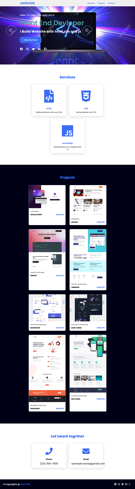

# Project - personal website

## Table of contents

- [Screenshot](#screenshot)
- [Links](#links)
- [Built with](#built-with)
- [Continued development](#continued-development)
- [Author](#author)

### Screenshot

### Links

- Solution URL: [click here](https://github.com/elasri21/pesronal_website)
- Live Site URL: [click here](https://elasri21.github.io/pesronal_website/)

### Built with

- Semantic HTML5 markup
- CSS custom properties
- Flexbox
- CSS Grid
- JavaScript

## Author

- linkedin - [Elasri Mohamed](https://www.linkedin.com/in/mohamed-elasri-a4ab8815a/)
   
- Github - [elasri21](https://github.com/elasri21)
   
- Frontend Mentor - [elasri21](https://www.frontendmentor.io/profile/elasri21)
   
- instagram - [@simo5904](https://www.instagram.com/simo5904/)
   
- Twitter - [Elasri Mohamed](https://x.com/ELASRI08455745)
   
- Facebook - [Elasri Mohamed](https://web.facebook.com/simo.asri.378)
   
